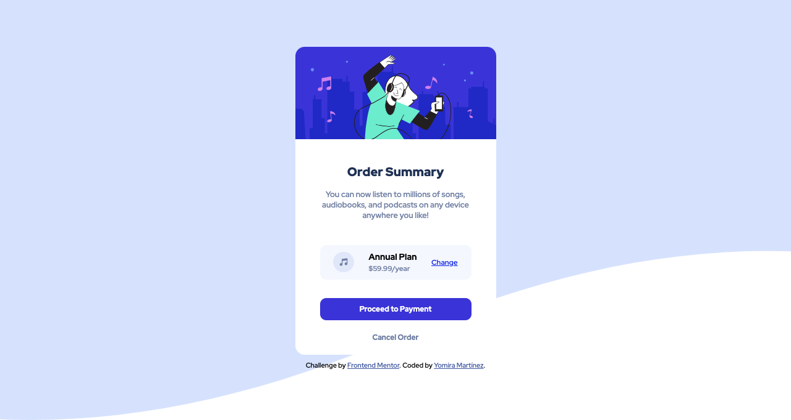

# Order-Component

Order Component Summary from Frontend Mentor Challenge

## Overview

This is the solution to the Order Component from Frontend Mentor; it was developed in HTML and CSS

This project can be displayed correctly in any resolution. The recommended resolutions of the challenge were:

- Mobile: 375 px
- Desktop: 1440 px

## Screenshots

## Solution's Link

- Solution URL: [Click Here](https://github.com/yomidev/Order-Component)
- Live Site URL: [Click Here](https://yomidev.github.io/Order-Component/)
  
## Authors

Yomira Martínez